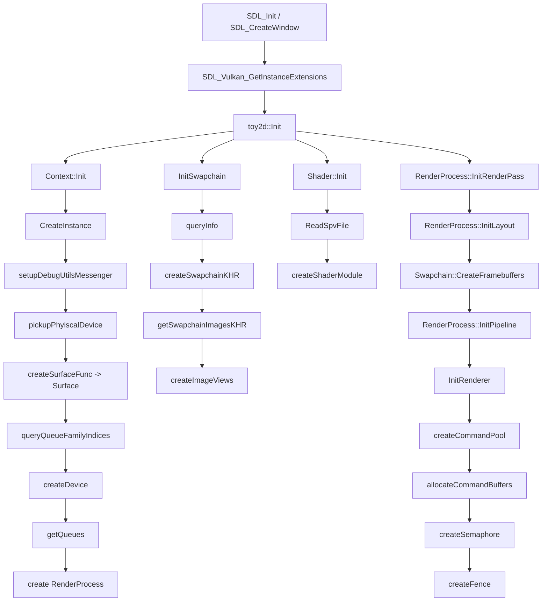
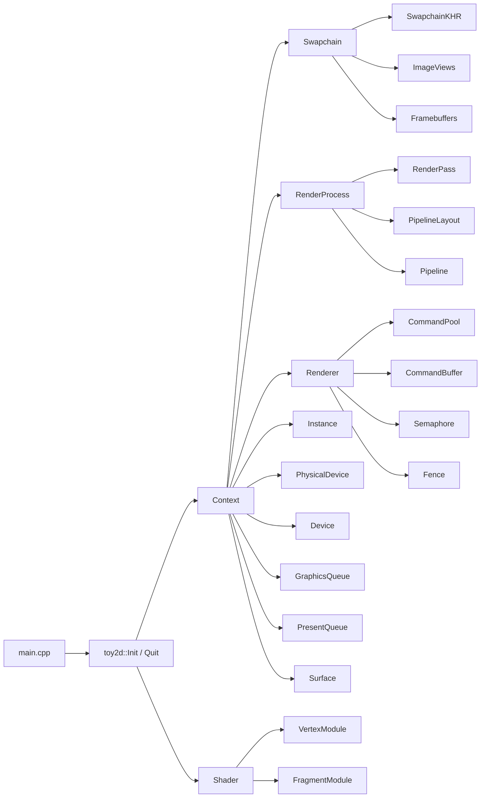
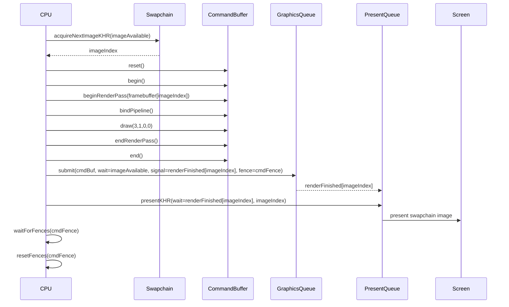
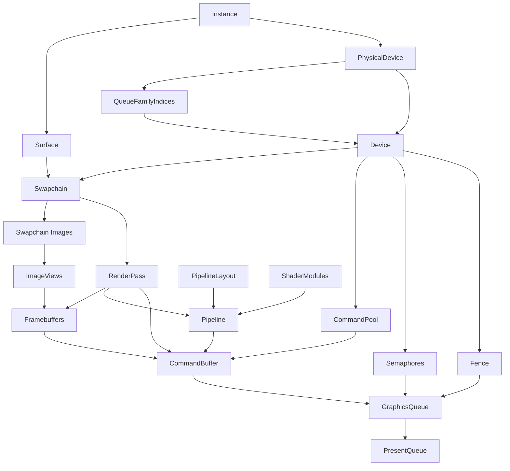
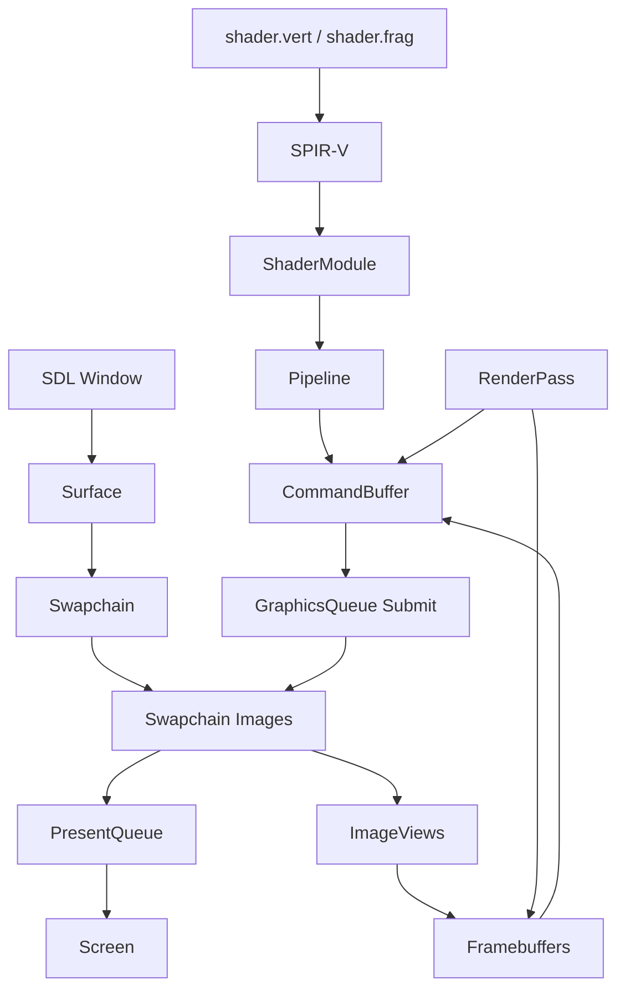
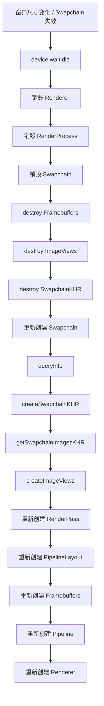

# 1 项目整体回顾

## 1.1 概念

前面的 01–09 章节分别拆开介绍了 `Instance`、`PhysicalDevice`、`Surface / Swapchain`、`Image / ImageView`、`Shader`、`Pipeline`、`RenderPass`、`Framebuffer`、`CommandBuffer / Semaphore / Fence`。  
把这些对象重新放回项目代码里看，会更容易理解一件事：**Vulkan 初始化并不是在“创建一堆对象”，而是在逐步搭建一条从窗口到 GPU，再到屏幕显示的完整链路。**

当前项目是一条非常典型的最小窗口渲染链路：

1. SDL 创建窗口；
2. Vulkan 创建 `Instance`；
3. SDL 基于窗口创建 `Surface`；
4. 选择 `PhysicalDevice`，查找 graphics / present queue family；
5. 创建 `Device` 和 `Queue`；
6. 创建 `Swapchain`，拿到 swapchain images；
7. 为 swapchain images 创建 `ImageView`；
8. 创建 `RenderPass`；
9. 为每张 swapchain image view 创建 `Framebuffer`；
10. 加载 shader，创建 `PipelineLayout` 和 `Pipeline`；
11. 创建 `CommandPool`、`CommandBuffer`、`Semaphore`、`Fence`；
12. 每帧 acquire image、录制命令、submit、present；
13. 退出时按依赖关系逆序销毁。

项目中最重要的不是单个对象本身，而是它们的依赖顺序：

```text
Window
    -> Instance
    -> Surface
    -> PhysicalDevice / QueueFamily
    -> Device / Queue
    -> Swapchain
    -> ImageView
    -> RenderPass
    -> Framebuffer
    -> Shader
    -> PipelineLayout / Pipeline
    -> CommandBuffer / Sync
    -> Render Loop
```

这也是 Vulkan 学习中最容易出现理解断层的地方：  
如果只按 API 名字记忆，很容易觉得对象很多、关系很散；但从“谁依赖谁”去看，整个项目其实就是一棵非常清晰的依赖树。

项目整体初始化依赖可以先看下面这张图：



这张图强调的是：**初始化顺序本质上就是依赖顺序。**

## 1.2 模块架构

### 1.2.1 项目中的核心模块

目标：先从代码组织层面理解各模块职责。  
当前项目可以粗略分成以下几层：

1. **平台入口层**
   - `src/main.cpp`
   - 职责：初始化 SDL、创建窗口、获取 SDL 所需 Vulkan instance extensions、把 surface 创建函数传给渲染系统。

2. **全局 Vulkan 上下文层**
   - `toy2d/Context.hpp`
   - `src/context.cpp`
   - 职责：持有 `Instance / PhysicalDevice / Device / Queue / Surface / Swapchain / RenderProcess / Renderer` 等全局核心对象。

3. **交换链与图像视图层**
   - `toy2d/swapchain.hpp`
   - `src/swapchain.cpp`
   - 职责：创建 swapchain、查询 surface 能力、获取 swapchain images、创建 image views、创建 framebuffers。

4. **渲染过程层**
   - `toy2d/render_process.hpp`
   - `src/render_process.cpp`
   - 职责：创建 `RenderPass`、`PipelineLayout`、`Graphics Pipeline`。

5. **Shader 管理层**
   - `toy2d/shader.hpp`
   - `src/shader.cpp`
   - 职责：读取 `.spv`、创建 shader modules、生成 pipeline shader stages。

6. **命令提交与同步层**
   - `toy2d/renderer.hpp`
   - `src/renderer.cpp`
   - 职责：创建 command pool / command buffer / semaphore / fence，执行每帧渲染循环。

7. **统一初始化封装层**
   - `src/toy2d.cpp`
   - 职责：把上面的初始化顺序串起来，形成 `toy2d::Init()` 和 `toy2d::Quit()`。

这几个模块的关系可以概括为：

```text
main.cpp
    -> toy2d::Init
        -> Context
        -> Swapchain
        -> Shader
        -> RenderProcess
        -> Renderer
```

如果从代码组织角度看，模块结构关系可以用下面这张图概括：



这张图更强调“模块持有什么”和“模块之间通过什么对象连接”。

### 1.2.2 `Context` 为什么是核心

目标：理解为什么项目中很多模块都通过 `Context::GetInstance()` 取对象。  
`Context` 可以看成当前项目的 Vulkan 全局依赖容器：

```cpp
vk::Instance instance;
vk::PhysicalDevice phyDevice;
vk::Device device;
vk::Queue graphicsQueue;
vk::Queue presentQueue;
vk::SurfaceKHR surface;
std::unique_ptr<Swapchain> swapchain;
std::unique_ptr<RenderProcess> renderProcess;
std::unique_ptr<Renderer> renderer;
```

这意味着：

1. `Swapchain` 创建时要访问 `device / surface / phyDevice / queueFamilyIndices`；
2. `RenderProcess` 创建时要访问 `device / swapchain`；
3. `Renderer` 渲染时要访问 `device / renderProcess / swapchain / queues`；
4. `Shader` 创建 shader module 时要访问 `device`。

因此项目当前架构是“以 `Context` 为中心的聚合式结构”。  
优点是初始化顺序直观、对象引用方便；缺点是耦合偏高，模块之间不是完全独立。

对学习项目来说，这种结构是合理的，因为它把 Vulkan 依赖关系直接暴露出来，便于观察。

# 2 运行流程

## 2.1 初始化流程

### 2.1.1 平台初始化与窗口创建：`SDL_Init` / `SDL_CreateWindow`

目标：拿到一个真正可以承载 Vulkan surface 的窗口。  
项目入口：

```cpp
SDL_Init(SDL_INIT_VIDEO);

SDL_Window* window = SDL_CreateWindow(
    "Toy2D",
    1024, 720,
    SDL_WINDOW_RESIZABLE | SDL_WINDOW_VULKAN
);
```

这里的 `SDL_WINDOW_VULKAN` 很关键。  
它告诉 SDL：这个窗口后续会用于 Vulkan，而不是普通软件渲染或其他图形后端。

随后查询 SDL 需要的 instance extensions：

```cpp
uint32_t extensionCount = 0;
const char* const* sdlExtensions =
    SDL_Vulkan_GetInstanceExtensions(&extensionCount);

std::vector<const char*> extensions(
    sdlExtensions,
    sdlExtensions + extensionCount
);
```

这一步把平台相关扩展从 SDL 抽出来，供后续 `vk::Instance` 创建时使用。

---

### 2.1.2 初始化 Vulkan 上下文：`Context::Init`

目标：完成 instance、surface、physical device、device、queue 的建立。  
项目通过：

```cpp
Context::Init(extensions, createSurfaceFunc);
```

进入 `Context` 构造函数：

```cpp
CreateInstance(extensions);
setupDebugUtilsMessenger();
pickupPhyiscalDevice();
surface = createSurfaceFunc(instance);
queryQueueFamilyIndices();
createDevice();
getQueues();
renderProcess.reset(new RenderProcess());
```

这一段顺序不能随意打乱：

1. 没有 `Instance`，就没有后续一切；
2. 没有 `Surface`，就无法查询 present queue；
3. 没有 queue family，就无法正确创建 `Device`；
4. 没有 `Device`，就无法创建 swapchain、shader module、render pass、pipeline。

这一步结束后，项目已经具备：

1. Vulkan 全局实例；
2. 可用物理设备；
3. logical device；
4. graphics queue 和 present queue；
5. 可用于窗口呈现的 surface。

---

### 2.1.3 初始化交换链、渲染过程与渲染器：`toy2d::Init`

目标：完成真正“能渲染一帧”的剩余对象搭建。  
`src/toy2d.cpp` 把整体流程串起来：

```cpp
Context::Init(extensions, createSurfaceFunc);
auto& ContextInstance = Context::GetInstance();
ContextInstance.InitSwapchain(w, h);

Shader::Init("shader/shader.vert.spv", "shader/shader.frag.spv");
ContextInstance.renderProcess->InitRenderPass();
ContextInstance.renderProcess->InitLayout();
ContextInstance.swapchain->CreateFramebuffers(w, h);
ContextInstance.renderProcess->InitPipeline(w, h);
ContextInstance.InitRenderer();
```

这里可以看出项目当前的初始化依赖链：

```text
Context
    -> Swapchain
    -> Shader
    -> RenderPass
    -> PipelineLayout
    -> Framebuffer
    -> Pipeline
    -> Renderer
```

其中顺序上有几个特别重要的点：

1. `Swapchain` 必须先于 `RenderPass`，因为 render pass 要用 swapchain format；
2. `RenderPass` 必须先于 `Framebuffer`，因为 framebuffer 需要指定 render pass；
3. `PipelineLayout` 和 `RenderPass` 都要先创建，才能创建 `Pipeline`；
4. `Renderer` 放在最后，因为它依赖 command buffer 录制时会用到的 swapchain、pipeline、render pass、framebuffer。

## 2.2 每帧运行流程

### 2.2.1 主循环：`renderer.Render()`

目标：在 SDL 事件循环中持续执行一帧渲染。  
`main.cpp` 中：

```cpp
while (!shouldClose) {
    while (SDL_PollEvent(&event)) {
        if (event.type == SDL_EVENT_QUIT) {
            shouldClose = true;
        }
    }

    renderer.Render();
}
```

项目当前没有复杂的游戏逻辑、场景更新和资源流式加载，因此主循环非常纯粹：  
处理输入事件，然后绘制一帧。

---

### 2.2.2 Acquire -> Record -> Submit -> Present

目标：理解一帧中 GPU 工作是如何被推进的。  
当前项目的 `Renderer::Render()` 可以概括为：

```text
acquireNextImageKHR
    -> reset command buffer
    -> begin command buffer
    -> begin render pass
    -> bind pipeline
    -> draw
    -> end render pass
    -> end command buffer
    -> graphics queue submit
    -> present queue present
    -> wait fence
    -> reset fence
```

对应关键代码：

```cpp
auto result = device.acquireNextImageKHR(..., imageAvaliable_);
auto imageIndex = result.value;

cmdBuf_.reset();
cmdBuf_.begin(begin);
cmdBuf_.beginRenderPass(renderPassBegin, {});
cmdBuf_.bindPipeline(vk::PipelineBindPoint::eGraphics, renderProcess->pipeline);
cmdBuf_.draw(3, 1, 0, 0);
cmdBuf_.endRenderPass();
cmdBuf_.end();

graphicsQueue.submit(submit, cmdAvaliableFence_);
presentQueue.presentKHR(present);
device.waitForFences(cmdAvaliableFence_, true, ...);
device.resetFences(cmdAvaliableFence_);
```

这条链路体现了 Vulkan 运行时最核心的设计：

1. CPU 先录制命令；
2. GPU 通过 queue 异步执行；
3. semaphore 负责 GPU 与 GPU 之间的顺序；
4. fence 负责 CPU 等待 GPU。

如果把一帧运行过程画成时序图，会更容易看清 acquire、submit、present 和 fence 的关系：



这张图说明：**一帧真正的推进顺序，不是“draw 立刻显示”，而是 acquire -> record -> submit -> present -> CPU 等待。**

# 3 数据流向

## 3.1 对象依赖流

### 3.1.1 从窗口到屏幕的对象流向

目标：把前面零散的对象依赖串成一条完整通路。  
项目当前最重要的对象流向是：

```text
SDL_Window
    -> vk::SurfaceKHR
    -> vk::SwapchainKHR
    -> vk::Image[]
    -> vk::ImageView[]
    -> vk::Framebuffer[]
    -> vk::RenderPass
    -> vk::Pipeline
    -> vk::CommandBuffer
    -> vk::Queue submit / present
```

这条链路里每个对象的职责是：

1. `Surface`：连接窗口系统；
2. `Swapchain`：提供轮转呈现图像；
3. `Image`：真正存储像素；
4. `ImageView`：让 image 能被 attachment/采样访问；
5. `Framebuffer`：把具体 image view 绑定到 render pass attachment；
6. `RenderPass`：描述 attachment 的使用规则；
7. `Pipeline`：描述 shader 与固定功能状态；
8. `CommandBuffer`：记录 GPU 命令；
9. `Queue`：执行命令并呈现到屏幕。

如果把它进一步画成对象依赖图，可以更清楚地看到“谁依赖谁”：



这张图最适合用来判断“某个对象变了以后，后面哪些对象会被连带影响”。

## 3.2 渲染数据流

### 3.2.1 当前项目中的像素数据流

目标：说明屏幕上的红色三角形是如何一路生成出来的。  
当前项目没有 vertex buffer，没有纹理，也没有 uniform。  
因此像素数据流非常简洁：

```text
Vertex Shader:
    gl_VertexIndex -> 生成三个顶点位置

Fragment Shader:
    输出固定红色

RenderPass:
    把输出写入当前 swapchain framebuffer

Present:
    把写好的 swapchain image 提交给窗口系统显示
```

也就是说，当前项目中真正变化的数据只有两类：

1. **几何位置数据**
   - 不来自 CPU 上传的 vertex buffer；
   - 直接硬编码在 vertex shader 中。

2. **颜色数据**
   - 不来自纹理；
   - 直接在 fragment shader 中写死为红色。

所以这个项目当前更像是“Vulkan 渲染通路打通验证”，而不是“复杂资源驱动型渲染器”。

如果只看“像素从哪里来、最后到哪里去”，可以再把数据流向抽成一张图：



这张图强调的是：**shader 决定怎么写，framebuffer 决定写到哪，queue 决定什么时候执行，present 决定什么时候显示。**

---

### 3.2.2 同步流

目标：理解一帧里 GPU 和 CPU 的时序如何连接。  
同步流可以概括为：

```text
acquireNextImageKHR
    -> signal imageAvaliable_
    -> graphics submit wait imageAvaliable_
    -> graphics submit signal imageDrawFinish_[imageIndex]
    -> present wait imageDrawFinish_[imageIndex]
    -> graphics submit signal cmdAvaliableFence_
    -> CPU wait cmdAvaliableFence_
```

这条链路说明：

1. swapchain image 没准备好前，GPU 不能写；
2. 渲染没完成前，present 不能读；
3. GPU 没完成前，CPU 不能安全重用 command buffer 和 fence。

## 3.3 所有权与生命周期流

### 3.3.1 谁创建谁、谁依赖谁

目标：从资源管理角度理解对象生命周期。  
项目里当前可以粗略看成以下几组依赖：

1. `Instance`
   - 拥有实例级上下文；
   - `Surface` 与 debug messenger 依赖它。

2. `Device`
   - 创建 `Swapchain`、`ImageView`、`RenderPass`、`PipelineLayout`、`Pipeline`、`CommandPool`、`CommandBuffer`、`Semaphore`、`Fence`。

3. `Swapchain`
   - 拥有 swapchain images；
   - `ImageView` 依赖这些 images；
   - `Framebuffer` 依赖 image views。

4. `RenderPass`
   - `Framebuffer` 和 `Pipeline` 都依赖它。

5. `PipelineLayout`
   - `Pipeline` 依赖它。

因此退出时必须逆序释放：

```text
Renderer
    -> Pipeline / PipelineLayout / RenderPass
    -> Shader
    -> Framebuffer / ImageView / Swapchain
    -> Device
    -> Surface
    -> DebugMessenger
    -> Instance
```

# 4 数据变化时如何重建

## 4.1 为什么 Vulkan 要“重建”

Vulkan 中很多对象是显式、不可变或半不可变的。  
这意味着某些关键输入一旦变化，就不能“在线修改一点点”，而是要销毁旧对象并创建新对象。

项目当前最常见的重建触发源主要有四类：

1. **窗口尺寸变化**
2. **swapchain format / present mode / image count 变化**
3. **render pass attachment 结构变化**
4. **pipeline 固定状态变化**

可以简单理解为：

```text
谁依赖发生变化的数据，谁就要重建
```

## 4.2 窗口尺寸变化时的重建链

### 4.2.1 当前项目里哪些对象依赖尺寸

目标：明确 resize 会影响哪些对象。  
当前项目中，窗口尺寸变化会直接影响：

1. `SwapchainInfo::imageExtent`
2. swapchain images
3. image views
4. framebuffers
5. pipeline 中固定 viewport/scissor

相关代码位置：

```cpp
info.imageExtent.width = std::clamp<uint32_t>(...);
info.imageExtent.height = std::clamp<uint32_t>(...);
```

以及：

```cpp
vk::Viewport viewport(0, 0, width, height, 0, 1);
vk::Rect2D rect({0, 0}, {static_cast<uint32_t>(width), static_cast<uint32_t>(height)});
```

因此当前项目如果窗口尺寸变化，至少要重建：

1. `Swapchain`
2. `ImageView`
3. `Framebuffer`
4. `Pipeline`

如果后续 render pass 也依赖尺寸相关 attachment 结构变化，则 render pass 也可能要重建。

---

### 4.2.2 推荐重建顺序

目标：给出当前项目结构下最自然的 resize 重建链。  
由于当前项目还没有真正实现 resize 回调和 swapchain recreate，可以先从依赖关系上理解推荐顺序：

```text
device.waitIdle()
    -> destroy Renderer
    -> destroy Pipeline
    -> destroy RenderPass（如果 format/attachment 规则变化）
    -> destroy Swapchain（内部会销毁 framebuffer / imageView / swapchain）
    -> recreate Swapchain
    -> recreate RenderPass（如有需要）
    -> recreate Framebuffer
    -> recreate Pipeline
    -> recreate Renderer（如果 command/sync 结构与 swapchain image 数量相关）
```

结合当前代码，可以更具体地写成：

```cpp
device.waitIdle();

renderer.reset();
renderProcess.reset();
DestroySwapchain();

InitSwapchain(newWidth, newHeight);
renderProcess.reset(new RenderProcess());
renderProcess->InitRenderPass();
renderProcess->InitLayout();
swapchain->CreateFramebuffers(newWidth, newHeight);
renderProcess->InitPipeline(newWidth, newHeight);
InitRenderer();
```

当前 `Renderer` 里有一个和 swapchain image 数量绑定的对象：

```cpp
imageDrawFinish_.resize(Context::GetInstance().swapchain->images.size());
```

所以当 swapchain image 数量变化时，renderer 里的 per-image semaphore 也应该一起重建。

如果把 resize / swapchain recreate 过程画成流程图，重建链会更直观：



这张图体现的核心原则是：**先停 GPU，再逆序销毁旧依赖链，然后按依赖顺序重建新链。**

## 4.3 format、attachment、shader 变化时的重建链

### 4.3.1 Swapchain format 改变

目标：说明 format 改变会沿着哪条链路向上传播。  
当前项目 render pass 使用：

```cpp
attachDesc.setFormat(Context::GetInstance().swapchain->info.format.format);
```

image view 也使用：

```cpp
createInfo.setFormat(info.format.format);
```

因此 swapchain format 改变时，至少会影响：

1. image views；
2. render pass；
3. framebuffers；
4. pipeline。

也就是说，format 变化不是只重建 swapchain 本身，而是会把依赖 format 的整条渲染路径一起带动起来。

---

### 4.3.2 RenderPass attachment 结构变化

目标：说明“从只有 color attachment 变成 color + depth”时要重建什么。  
一旦 render pass attachment 结构变化，例如加入 depth attachment，会影响：

1. `RenderPass`
2. `Framebuffer`
3. `Pipeline`
4. 相关 image / image view（如 depth image）

原因是：

1. render pass attachment 描述变了；
2. framebuffer attachment 数组也要跟着变；
3. pipeline 必须与新的 render pass 兼容；
4. shader / depth state / subpass 配置也可能调整。

---

### 4.3.3 Shader 或固定功能状态变化

目标：说明 shader 更新为什么通常意味着 pipeline 重建。  
当前 pipeline 创建时写入了：

```cpp
createInfo.setStages(stages)
          .setRenderPass(renderPass)
          .setLayout(layout);
```

并且还固化了：

1. viewport/scissor；
2. rasterization；
3. multisample；
4. color blend；
5. input assembly。

因此以下变化通常要重建 pipeline：

1. shader modules 变化；
2. vertex input 变化；
3. topology 变化；
4. cull mode / polygon mode / front face 变化；
5. blend state 变化；
6. depth stencil state 变化；
7. render pass 变化；
8. pipeline layout 变化。

而如果只是 command buffer 录制内容变化，例如 draw 次数变化、clear color 变化、绑定不同 framebuffer，通常不必重建 pipeline。

## 4.4 当前项目最实用的重建判断法

### 4.4.1 用“谁依赖谁”倒推

目标：给出一个在后续扩展项目时可重复使用的判断方法。  
当某个数据变化时，可以按以下问题倒推：

1. 这个数据被哪些对象直接引用？
2. 这些对象创建时是否把该数据固化进去了？
3. 这些对象是否又被其他对象依赖？

例如：

#### 例 1：窗口尺寸变化

```text
width / height
    -> swapchain extent
    -> framebuffer size
    -> viewport/scissor
```

所以重建链大致是：

```text
swapchain -> framebuffer -> pipeline
```

#### 例 2：shader 变了

```text
shader module
    -> pipeline stages
    -> pipeline
```

所以至少要重建：

```text
shader -> pipeline
```

#### 例 3：加入 depth attachment

```text
depth image / imageView
    -> framebuffer
    -> render pass
    -> pipeline
```

所以至少要重建：

```text
depth resources -> render pass -> framebuffer -> pipeline
```

# 5 项目当前状态与后续演进方向

## 5.1 当前项目处于哪一步

当前项目已经完成了一个标准 Vulkan 最小窗口渲染器的核心骨架：

1. 有窗口系统接入；
2. 有完整 instance -> device -> swapchain 路径；
3. 有 shader / render pass / framebuffer / pipeline；
4. 有 command buffer 和 GPU/CPU 同步；
5. 能稳定地把一帧三角形提交到屏幕。

这意味着后续扩展基本都可以在这个骨架上逐步叠加，而不需要推倒重来。  
后续新增功能大多只是给现有依赖树增加新的分支，例如：

1. **顶点缓冲**
   - 新增 `Buffer / DeviceMemory`
   - 扩展 vertex input 与 command buffer。

2. **纹理**
   - 新增普通 image / image view / sampler / descriptor。

3. **深度测试**
   - 新增 depth image / render pass attachment / framebuffer attachment / pipeline depth state。

4. **窗口 resize 重建**
   - 增加 swapchain recreate 逻辑。

5. **多帧并行**
   - 增加 per-frame command buffer / semaphore / fence。

## 5.2 一句话总结

从 01 到 09 章节回到项目代码，可以把整个项目概括成一句话：

> 项目当前做的事情，是把 SDL 窗口、Vulkan 对象依赖树、渲染状态对象、命令提交和同步机制拼接成一条“从 CPU 录制命令，到 GPU 渲染 swapchain image，再到窗口系统显示”的最小闭环。

理解了这条闭环，后续无论是加纹理、加深度、加 uniform、加后处理、做 resize 重建，思路都会变得统一：  
**先找变化源，再找依赖这个变化源的对象，最后按依赖关系重建。**
