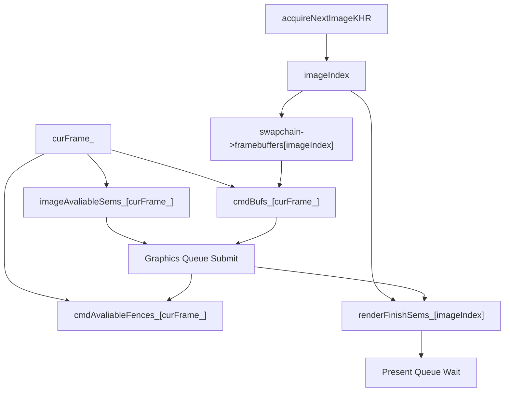
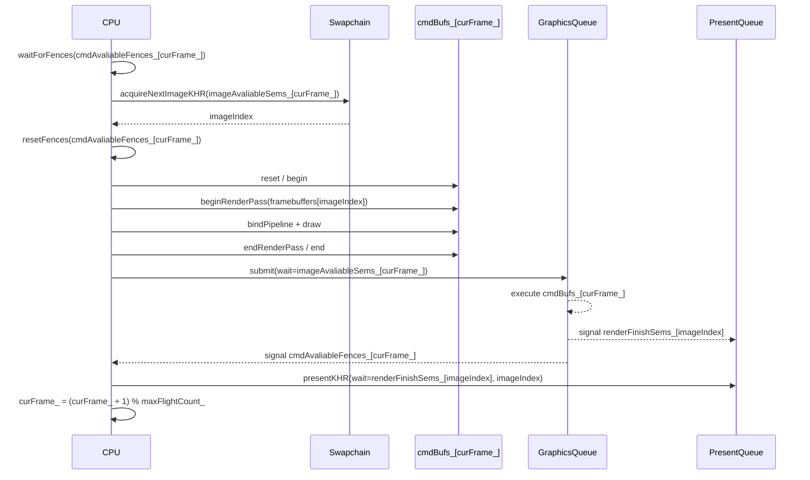
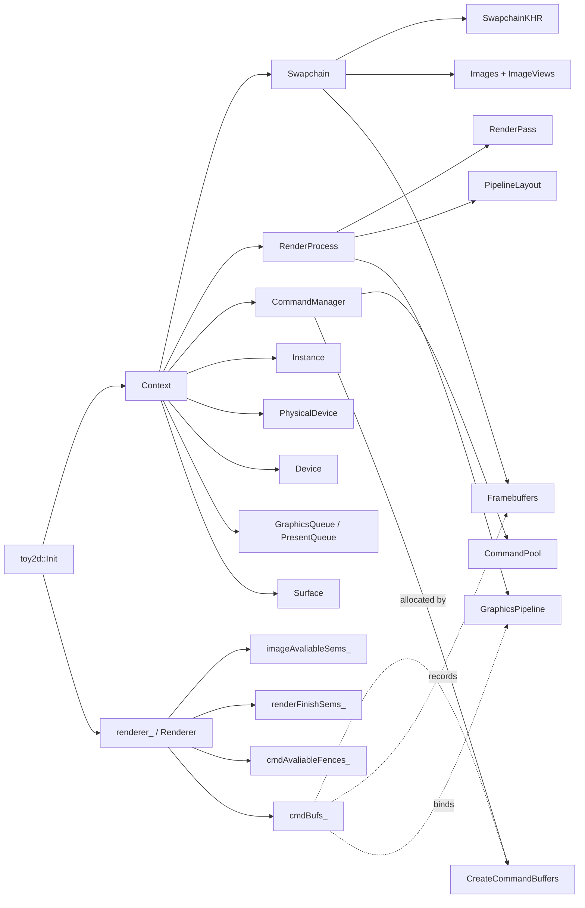
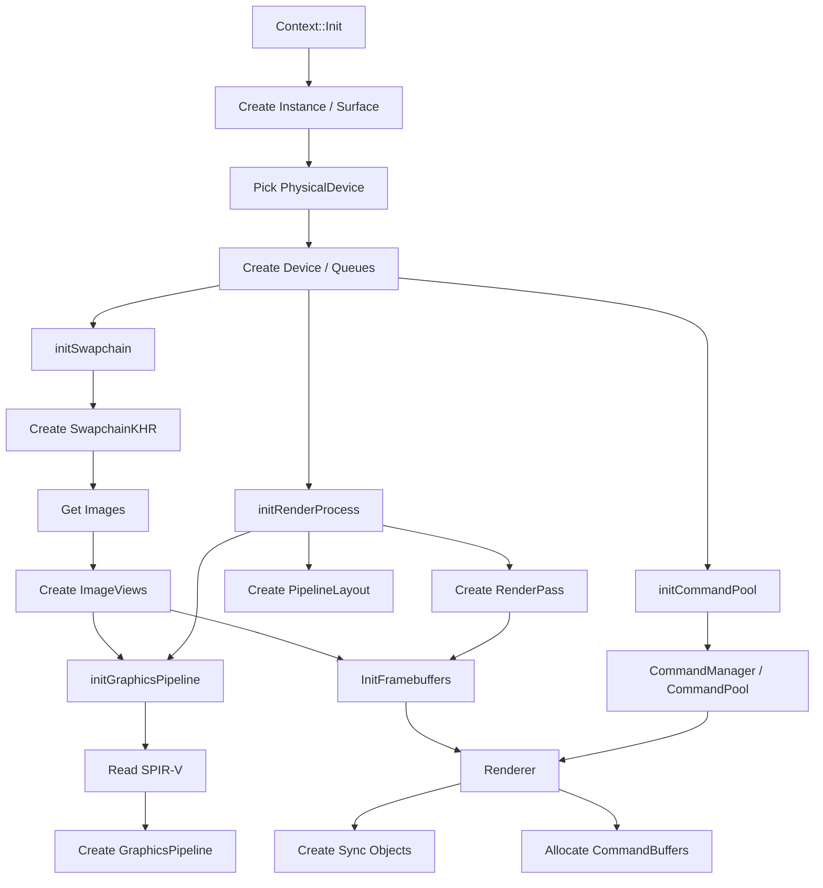
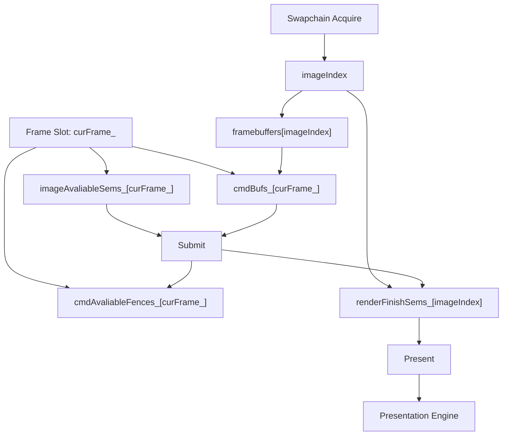
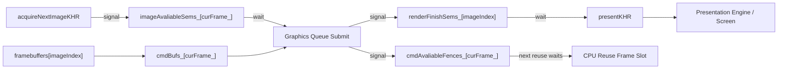
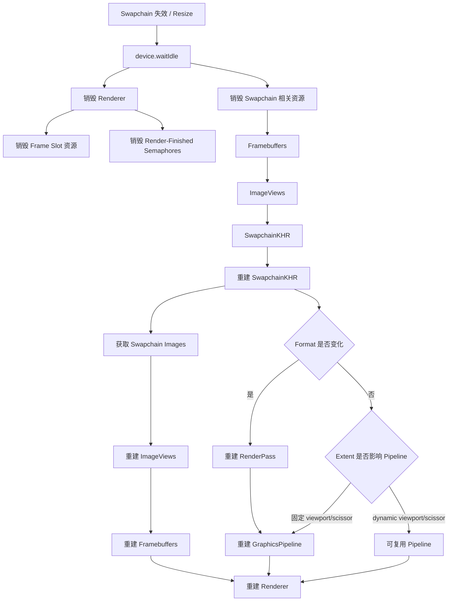

# 1 In-Flight 优化

## 1.1 概念

In-flight 优化的核心目标，是让 CPU 不必每一帧都等 GPU 完全做完之后才开始准备下一帧。  
在最早的串行版本里，一帧大致是：

```text
record command buffer
    -> submit
    -> present
    -> wait fence
    -> 下一帧
```

这种方式最容易理解，也最安全，但 CPU/GPU 并行度较低。  
因为 CPU 每帧都会停在 `waitForFences` 上，直到 GPU 完成当前提交。

重构后的渲染器引入了多组 frame 资源：

```cpp
int maxFlightCount_;
int curFrame_;

std::vector<vk::Semaphore> imageAvaliableSems_;
std::vector<vk::Semaphore> renderFinishSems_;
std::vector<vk::Fence> cmdAvaliableFences_;
std::vector<vk::CommandBuffer> cmdBufs_;
```

这些资源的作用是把“当前 CPU 正在准备哪一帧”和“GPU 正在执行哪一帧”拆开。  
每个 frame slot 拥有自己的：

1. image-available semaphore；
2. command buffer；
3. fence。

每张 swapchain image 仍然使用按 `imageIndex` 索引的 render-finished semaphore：

```cpp
auto& renderFinishSem = renderFinishSems_[imageIndex];
```

这条规则很重要。  
因为 render-finished semaphore 会被 `presentKHR` 异步等待，按 swapchain image 分配可以避免一个 semaphore 还可能被 presentation engine 使用时，又被下一帧提前 signal。

当前实现中：

```cpp
Renderer::Renderer(int swapchainImageCount)
    : maxFlightCount_(swapchainImageCount), curFrame_(0) {
    createFences();
    createSemaphores();
    createCmdBuffers();
}
```

这里把 `maxFlightCount_` 设置为 swapchain image 数量。  
对当前项目来说，这能让每张 swapchain image 都有对应的一组同步资源和 command buffer，结构直观。更通用的引擎里通常会进一步区分：

1. `MAX_FRAMES_IN_FLIGHT`：CPU 最多提前准备几帧，常见值是 2；
2. `swapchainImageCount`：swapchain 实际图像数量，常见是 2 或 3。

当前项目把两者合并，是一个适合学习阶段的简化。

把这套关系画成图，可以看到 in-flight 优化的关键不是“多创建几个对象”，而是把 **frame slot 资源** 和 **swapchain image 资源** 分开索引：



这张图里有两条线：

1. `curFrame_` 管 CPU 正在复用哪一组帧资源；
2. `imageIndex` 管本帧实际写入哪一张 swapchain image。

两者在 submit 阶段汇合：command buffer 来自当前 frame slot，framebuffer 和 render-finished semaphore 来自当前 swapchain image。

## 1.2 每帧流程

### 1.2.1 等待当前 Frame Slot：`vk::Device::waitForFences`

目标：确保当前 frame slot 中的 command buffer 不再被 GPU 使用。  
每次绘制开始时，先取当前 frame slot：

```cpp
auto& cmdAvaliableFence = cmdAvaliableFences_[curFrame_];
auto& imageAvaliableSem = imageAvaliableSems_[curFrame_];
auto& cmdBuf = cmdBufs_[curFrame_];
```

然后等待 fence：

```cpp
if (device.waitForFences({cmdAvaliableFence}, VK_TRUE, UINT64_MAX)
    != vk::Result::eSuccess) {
    throw std::runtime_error("wait for fence failed");
}
```

这一步回答的问题是：

```text
当前 frame slot 上一次提交的 GPU 工作是否完成？
```

如果完成，CPU 才可以安全重用这个 slot 里的 command buffer 和 fence。  
这不是等待整个 device 空闲，而是只等待当前 frame slot 对应的那次提交完成。

---

### 1.2.2 获取 Swapchain Image：`vk::Device::acquireNextImageKHR`

目标：获取本帧要写入的 swapchain image index。  
当前 frame slot 使用自己的 image-available semaphore：

```cpp
auto result = device.acquireNextImageKHR(
    swapchain->swapchain,
    std::numeric_limits<uint64_t>::max(),
    imageAvaliableSem
);
```

`imageAvaliableSem` 的含义是：

```text
当 acquire 到的 swapchain image 真正可写时，signal 这个 semaphore。
```

后续 graphics queue submit 会等待它，避免 GPU 在图像还不可写时就开始渲染。

当前代码在 acquire 成功后再 reset fence：

```cpp
device.resetFences({cmdAvaliableFence});
```

这个顺序比“先 reset fence 再 acquire”更安全。  
因为如果 acquire 失败并提前退出，本帧没有 submit，就不会出现 fence 已经 reset 但没有任何提交会 signal 它的死锁风险。

---

### 1.2.3 按 ImageIndex 选择 Render-Finished Semaphore

目标：把渲染完成信号和当前 swapchain image 绑定。  
acquire 成功后取得：

```cpp
auto imageIndex = result.value;
auto& renderFinishSem = renderFinishSems_[imageIndex];
auto& framebuffer = swapchain->framebuffers[imageIndex];
```

这里有两个重要含义：

1. `framebuffer` 按 `imageIndex` 选择，确保本帧渲染写入 acquire 到的那张 swapchain image；
2. `renderFinishSem` 也按 `imageIndex` 选择，确保 present 等待的是该 image 对应的渲染完成信号。

如果 render-finished semaphore 只按 frame slot 分配，在某些情况下可能发生 semaphore 还被上一轮 present 使用，却又被新的 submit signal 的问题。  
按 swapchain image 分配是更稳妥的规则。

---

### 1.2.4 录制当前 Frame Slot 的 CommandBuffer

目标：把本帧绘制命令写入当前 slot 的 command buffer。  
当前代码每帧重置并重新录制：

```cpp
cmdBuf.reset();

vk::CommandBufferBeginInfo beginInfo;
beginInfo.setFlags(vk::CommandBufferUsageFlagBits::eOneTimeSubmit);
cmdBuf.begin(beginInfo);
```

随后指定本帧 framebuffer：

```cpp
vk::RenderPassBeginInfo renderPassBegin;
renderPassBegin.setRenderPass(renderProcess->renderPass)
               .setFramebuffer(framebuffer)
               .setClearValues(clearValue)
               .setRenderArea(vk::Rect2D({}, swapchain->GetExtent()));
```

并录制绘制命令：

```cpp
cmdBuf.beginRenderPass(&renderPassBegin, vk::SubpassContents::eInline);
cmdBuf.bindPipeline(vk::PipelineBindPoint::eGraphics,
                    ctx.renderProcess->graphicsPipeline);
cmdBuf.draw(3, 1, 0, 0);
cmdBuf.endRenderPass();
cmdBuf.end();
```

这一步仍然只是 CPU 录制命令。  
GPU 真正执行这些命令发生在后面的 queue submit。

---

### 1.2.5 提交并推进 Frame Slot

目标：提交当前 command buffer，并通过 semaphore / fence 建立同步关系。  
当前提交：

```cpp
vk::SubmitInfo submit;
vk::PipelineStageFlags flags =
    vk::PipelineStageFlagBits::eColorAttachmentOutput;

submit.setCommandBuffers(cmdBuf)
      .setWaitSemaphores(imageAvaliableSem)
      .setWaitDstStageMask(flags)
      .setSignalSemaphores(renderFinishSem);

ctx.graphicsQueue.submit(submit, cmdAvaliableFence);
```

这段提交表达：

1. 等待当前 frame slot 的 `imageAvaliableSem`；
2. 执行当前 frame slot 的 command buffer；
3. 渲染完成后 signal 当前 image 的 `renderFinishSem`；
4. 整个 submit 完成后 signal 当前 frame slot 的 fence。

present 阶段等待 render-finished semaphore：

```cpp
vk::PresentInfoKHR presentInfo;
presentInfo.setWaitSemaphores(renderFinishSem)
           .setSwapchains(swapchain->swapchain)
           .setImageIndices(imageIndex);

ctx.presentQueue.presentKHR(presentInfo);
```

最后推进 frame slot：

```cpp
curFrame_ = (curFrame_ + 1) % maxFlightCount_;
```

这表示下一帧会使用下一组 command buffer / image-available semaphore / fence。

把完整的一帧展开成时序图，可以更直观看到 CPU、swapchain、graphics queue 和 present queue 之间的关系：



这张图强调两个等待点：

1. CPU 等 fence，是为了安全复用当前 frame slot；
2. present 等 render-finished semaphore，是为了确保该 swapchain image 已经渲染完成。

`imageAvaliableSems_[curFrame_]` 则连接 acquire 和 graphics submit，保证图像真正可写后才开始执行渲染命令。

# 2 重构后的代码结构

## 2.1 概念

重构后的项目把职责拆得更清楚。  
相比早期版本，核心变化包括：

1. `CommandManager` 负责 command pool 和 command buffer 分配；
2. `Renderer` 只负责每帧绘制、同步对象和提交；
3. `RenderProcess` 同时管理 render pass、pipeline layout、graphics pipeline；
4. `Swapchain` 内部封装 swapchain image、image view、framebuffer；
5. `Context` 作为全局 Vulkan 对象和模块依赖的聚合点。

整体结构可以概括为：

```text
Context
    -> Swapchain
    -> RenderProcess
    -> CommandManager

toy2d::renderer_
    -> Renderer
```

其中 `Renderer` 不再自己创建 command pool，而是通过：

```cpp
Context::Instance().commandManager->CreateOneCommandBuffer();
```

向 `CommandManager` 申请 command buffer。

重构后的模块关系可以画成下面这张图：



这张图可以看出，重构后的 `Renderer` 更像是运行时调度者：它不拥有 swapchain、render pass 或 pipeline，只是在每帧录制命令时引用这些对象。

## 2.2 初始化流程

### 2.2.1 `toy2d::Init`

目标：把重构后的模块按依赖顺序串起来。  
当前初始化入口：

```cpp
void Init(const std::vector<const char*>& extensions,
          Context::GetSurfaceCallback getSurfaceCb,
          int windowWidth,
          int windowHeight) {
    Context::Init(extensions, getSurfaceCb);
    auto& ctx = Context::Instance();
    ctx.initSwapchain(windowWidth, windowHeight);
    ctx.initRenderProcess();
    ctx.initGraphicsPipeline();
    ctx.swapchain->InitFramebuffers();
    ctx.initCommandPool();

    renderer_ = std::make_unique<Renderer>(ctx.swapchain->images.size());
}
```

这个顺序反映了依赖关系：

1. `Context::Init` 创建 instance、surface、device、queue；
2. `initSwapchain` 创建 swapchain、获取 images、创建 image views；
3. `initRenderProcess` 创建 pipeline layout 和 render pass；
4. `initGraphicsPipeline` 读取 SPIR-V 并创建 graphics pipeline；
5. `InitFramebuffers` 基于 render pass 和 image views 创建 framebuffers；
6. `initCommandPool` 创建 command manager；
7. `Renderer` 创建同步对象和多组 command buffers。

当前顺序中，framebuffer 在 pipeline 后创建。  
由于 framebuffer 依赖 render pass 和 image views，不依赖 pipeline，因此这个顺序可以工作。  
从依赖表达上看，也可以理解为：

```text
Swapchain + RenderPass
    -> Framebuffer

RenderPass + PipelineLayout + Shader
    -> GraphicsPipeline
```

两条链路都依赖 render pass，但 framebuffer 和 pipeline 彼此不直接依赖。

初始化顺序也可以表示为一条依赖链：



这里的重点不是函数名，而是依赖方向：越靠后的对象，越依赖前面已经确定的 device、swapchain、render pass、pipeline 或 command pool。

---

### 2.2.2 `Context` 的职责

目标：理解重构后 `Context` 负责哪些生命周期。  
`Context` 当前持有：

```cpp
vk::Instance instance;
vk::PhysicalDevice phyDevice;
vk::Device device;
vk::Queue graphicsQueue;
vk::Queue presentQueue;
std::unique_ptr<Swapchain> swapchain;
std::unique_ptr<RenderProcess> renderProcess;
std::unique_ptr<CommandManager> commandManager;
```

析构时：

```cpp
commandManager.reset();
renderProcess.reset();
swapchain.reset();
instance.destroySurfaceKHR(surface_);
device.destroy();
destroyDebugUtilsMessenger();
instance.destroy();
```

这里体现了重构后的一个关键变化：  
`Surface` 的销毁从 `Swapchain` 移回了 `Context`。这更符合所有权关系：

```text
Context 创建 Surface
Context 销毁 Surface
Swapchain 只使用 Surface
```

这对后续 swapchain recreate 很重要。  
因为重建 swapchain 时，不应该销毁 window surface；surface 应该跟随窗口和 instance 生命周期，而不是跟随某个具体 swapchain 生命周期。

---

### 2.2.3 `CommandManager` 的职责

目标：把 command pool 从 renderer 中拆出来。  
当前 `CommandManager` 创建 command pool：

```cpp
vk::CommandPoolCreateInfo createInfo;
createInfo.setQueueFamilyIndex(ctx.queueInfo.graphicsIndex.value()) 
          .setFlags(vk::CommandPoolCreateFlagBits::eResetCommandBuffer);

return ctx.device.createCommandPool(createInfo);
```

它提供两个接口：

```cpp
vk::CommandBuffer CreateOneCommandBuffer();
std::vector<vk::CommandBuffer> CreateCommandBuffers(std::uint32_t count);
```

这样 `Renderer` 不需要知道 command pool 如何创建，只需要申请 command buffer。  
职责边界变成：

```text
CommandManager:
    command pool / command buffer allocation

Renderer:
    per-frame command recording / submit / present
```

`ResetCmds()` 当前会 reset 整个 command pool：

```cpp
Context::Instance().device.resetCommandPool(pool_);
```

这个接口后续使用时要特别小心。  
只有当该 pool 分配出的 command buffers 都不再处于 pending 状态时，才能 reset 整个 pool。

# 3 In-Flight 数据流

## 3.1 Frame Slot 与 Swapchain Image

In-flight 优化里有两个索引需要区分：

1. `curFrame_`
   - 当前 CPU 正在使用的 frame slot；
   - 用来索引 command buffer、image-available semaphore、fence。

2. `imageIndex`
   - `acquireNextImageKHR` 返回的 swapchain image index；
   - 用来索引 framebuffer 和 render-finished semaphore。

当前代码：

```cpp
auto& cmdAvaliableFence = cmdAvaliableFences_[curFrame_];
auto& imageAvaliableSem = imageAvaliableSems_[curFrame_];
auto& cmdBuf = cmdBufs_[curFrame_];

auto imageIndex = result.value;
auto& renderFinishSem = renderFinishSems_[imageIndex];
auto& framebuffer = swapchain->framebuffers[imageIndex];
```

这段代码体现了两条不同生命周期：

```text
curFrame_:
    CPU 准备帧资源的轮转索引

imageIndex:
    当前实际写入哪张 swapchain image
```

不要把这两个概念混为一谈。  
当前项目为了简化，把 `maxFlightCount_` 设置为 swapchain image count，因此两类数组长度相同；但语义上仍然不同。

这两套索引在一帧中会这样汇合：



如果后续把 `MAX_FRAMES_IN_FLIGHT` 固定为 2，而 swapchain image count 为 3，这张图仍然成立。变化的只是两组数组长度不再相同，语义仍然分别对应 frame slot 和 swapchain image。

## 3.2 一帧的同步数据流

当前帧可以画成：

```text
curFrame_
    -> imageAvaliableSems_[curFrame_]
    -> cmdBufs_[curFrame_]
    -> cmdAvaliableFences_[curFrame_]

acquireNextImageKHR
    -> imageIndex
    -> framebuffers[imageIndex]
    -> renderFinishSems_[imageIndex]
```

提交链路：

```text
imageAvaliableSems_[curFrame_]
    -> graphics queue wait
    -> cmdBufs_[curFrame_] 执行
    -> graphics queue signal renderFinishSems_[imageIndex]
    -> present wait renderFinishSems_[imageIndex]
    -> fence signal cmdAvaliableFences_[curFrame_]
```

这条链路保证：

1. acquire 到的 image 可写后才开始渲染；
2. 渲染完成后才 present；
3. 当前 frame slot 的 GPU 工作完成后，CPU 才重用该 slot。

同步数据流可以进一步画成从 acquire 到 present 的闭环：



这里的 fence 和 semaphore 解决的是不同方向的问题：

1. semaphore 主要描述 GPU 队列之间、swapchain 与 queue 之间的执行顺序；
2. fence 主要描述 GPU 到 CPU 的完成通知，让 CPU 判断资源是否可以复用。

# 4 重建与后续扩展

## 4.1 Swapchain 重建时的影响

In-flight 重构之后，swapchain 重建会影响更多对象。  
因为 renderer 内部有一些资源数量与 swapchain image count 相关：

```cpp
renderer_ = std::make_unique<Renderer>(ctx.swapchain->images.size());
```

当 swapchain 重建导致 image count 变化时，至少需要重建：

1. swapchain；
2. image views；
3. framebuffers；
4. renderer 中的 render-finished semaphores；
5. 如果 frame slot 数量也跟随 swapchain image count，command buffers / image-available semaphores / fences 也要重建；
6. 如果 extent 改变且 viewport/scissor 固定在 pipeline 中，graphics pipeline 也要重建。

当前 pipeline 的 viewport/scissor 使用 swapchain extent：

```cpp
vk::Viewport viewport(
    0, 0,
    ctx.swapchain->GetExtent().width,
    ctx.swapchain->GetExtent().height,
    0, 1
);
```

因此窗口尺寸变化时，pipeline 也需要重建，或者后续改为 dynamic viewport/scissor。

## 4.2 推荐的重建思路

当前结构下，resize / swapchain out-of-date 的重建思路可以概括为：

```text
device.waitIdle()
    -> renderer_.reset()
    -> commandManager.reset()（如果 command buffers 需要整体重建）
    -> destroy framebuffers / image views / swapchain
    -> recreate swapchain
    -> recreate render pass（如果 format/attachment 规则变化）
    -> recreate graphics pipeline（如果 extent 或 render pass 变化）
    -> recreate framebuffers
    -> recreate command manager / renderer
```

其中 surface 不应该随 swapchain 销毁。  
当前 `Context` 持有并销毁 surface，这为后续 swapchain recreate 留出了正确生命周期。

把重建影响画成图，可以更清楚地区分“必须跟 swapchain 重建的对象”和“只有在格式或尺寸变化时才需要重建的对象”：



当前项目的 viewport/scissor 仍固化在 pipeline 中，所以 resize 时应按“Extent 影响 Pipeline”的路径处理。后续如果改成 dynamic viewport/scissor，resize 时可以减少 pipeline 重建。

## 4.3 后续结构改进方向

当前重构已经把 renderer 从“单帧串行等待”推进到“多 slot 轮转”的结构。  
后续还可以继续细化：

1. **区分 `MAX_FRAMES_IN_FLIGHT` 和 `swapchainImageCount`**
   - frame slot 数量通常固定为 2；
   - render-finished semaphore 仍按 swapchain image 数量创建。

2. **加入 image-in-flight tracking**
   - 记录每张 swapchain image 当前是否正在被某个 frame fence 使用；
   - acquire 到某张 image 后，如果它仍被某个 fence 占用，则先等待该 fence。

3. **处理 `eErrorOutOfDateKHR` / `eSuboptimalKHR`**
   - acquire 或 present 返回这些结果时触发 swapchain recreate；
   - 不应简单 throw 结束程序。

4. **使用 dynamic viewport/scissor**
   - 减少窗口 resize 时 pipeline 重建压力。

5. **使用 RAII 或 UniqueHandle**
   - 降低 shader module、pipeline、framebuffer 等对象异常路径泄漏风险。

# 5 小结

重构后的代码把渲染器推进到了更接近真实 Vulkan 程序的结构：

1. `CommandManager` 管 command pool 和 command buffer 分配；
2. `Renderer` 管 per-frame 同步、命令录制、submit 和 present；
3. `renderFinishSems_` 按 swapchain image 使用，避免 present semaphore 复用问题；
4. `cmdAvaliableFences_` 按 frame slot 使用，保证 command buffer 重用安全；
5. `Surface` 生命周期回到 `Context`，更适合后续 swapchain recreate；
6. `Swapchain` 专注于 swapchain、image view、framebuffer；
7. `RenderProcess` 专注于 render pass、pipeline layout、graphics pipeline。

这次重构的核心收益不是代码行数减少，而是把 Vulkan 中几种不同生命周期拆开了：

```text
Context 生命周期:
    instance / device / surface

Swapchain 生命周期:
    swapchain / image views / framebuffers

RenderProcess 生命周期:
    render pass / pipeline layout / pipeline

Frame Slot 生命周期:
    command buffer / image-available semaphore / fence

Swapchain Image 生命周期:
    framebuffer / render-finished semaphore
```

理解这些生命周期的分离，是后续继续实现 resize、纹理、深度、后处理和多帧并行的基础。
